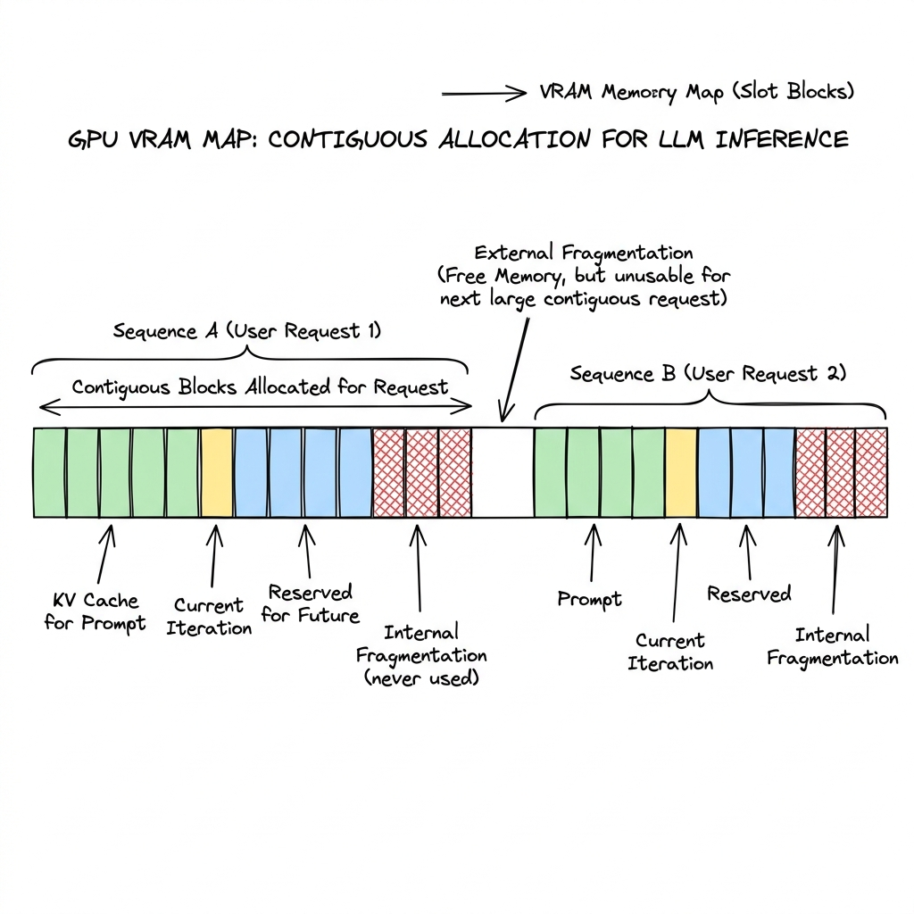
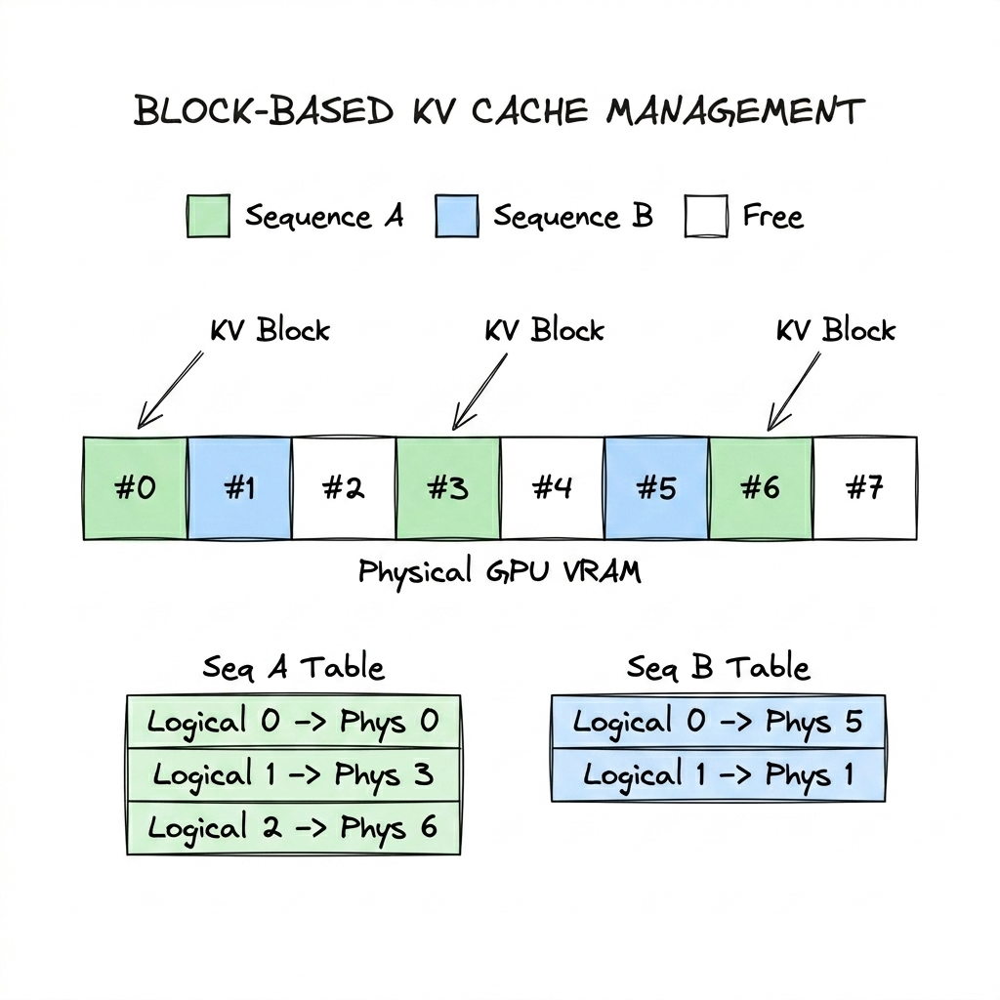
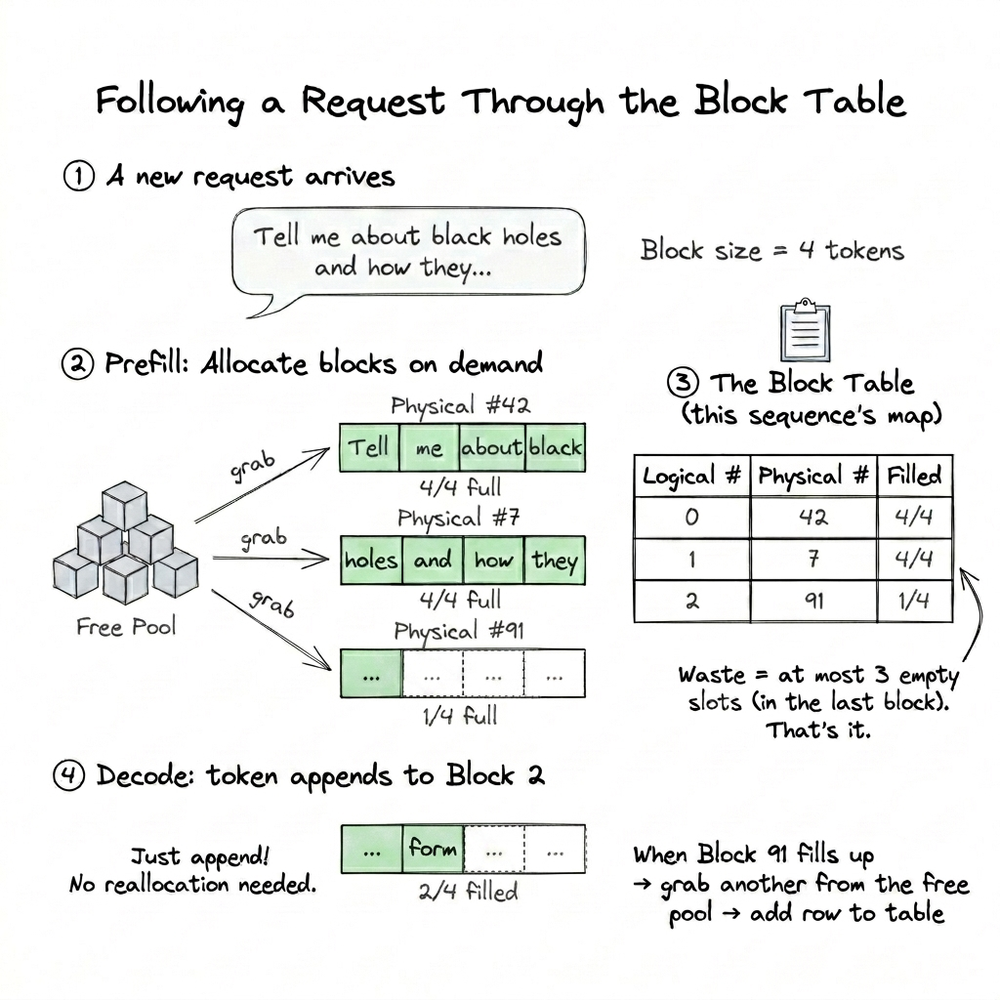
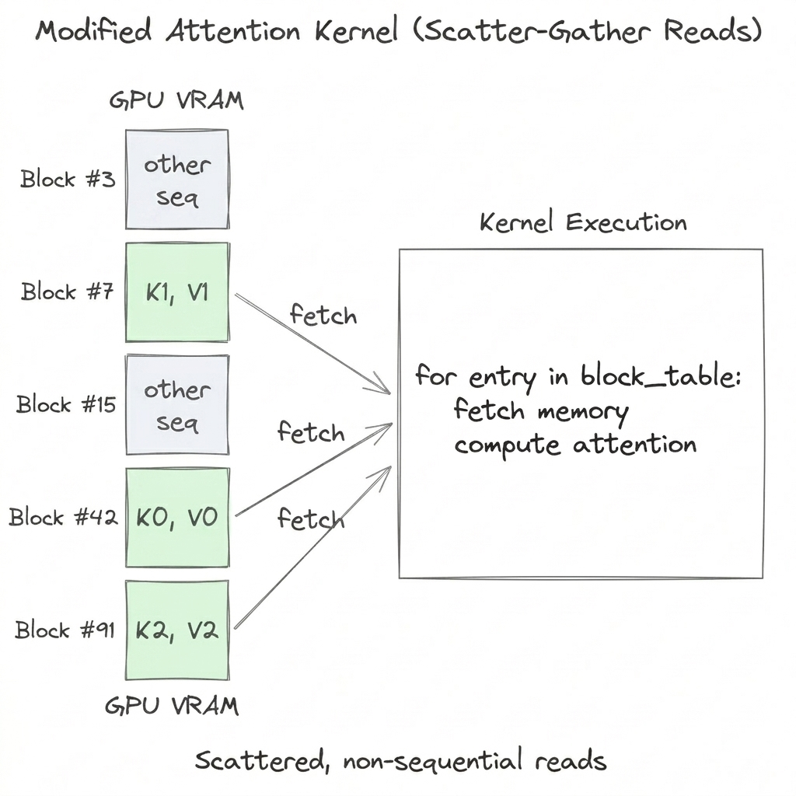
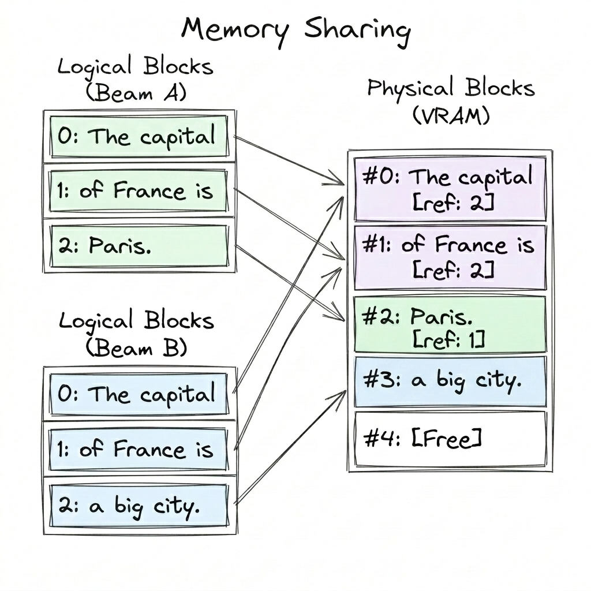

# Unpacking PagedAttention: The Mechanics of Modern LLM Inference

Here's something that bothered me when I first started reading about LLM serving: every token the model generates requires attending over all the tokens that came before it. That history (the key and value projection vectors, stored per-token, per-layer) is what we call the **KV Cache**, and it grows with every single decode step.

That's manageable for one user. But multiply it by hundreds of concurrent requests on a single GPU, and the KV cache quickly becomes the biggest memory hog in your system. What's worse, until fairly recently, the way engines managed this memory was surprisingly crude. vLLM's **PagedAttention** (Kwon et al., 2023) changed that by borrowing a trick straight from operating systems, virtual memory paging, and applying it to GPU KV cache management.

Let me walk through how it works and why it matters.

---

## The Contiguous Allocation Problem

Before PagedAttention, serving engines stored each sequence's KV cache as a **single contiguous tensor** in GPU memory. Seems reasonable enough, until you realize the engine doesn't know how long a sequence will be when the request first comes in. So it hedges: it pre-allocates memory for the **maximum possible output length**, right upfront.

This is where things get wasteful, and the waste comes from three directions at once:

<p align="center"></p>

Let's make this concrete. Say your system is configured with a `max_seq_len` of 2048 tokens. A request shows up with a 120-token prompt. The engine has no idea when the model will spit out an `<EOS>` token, so to be safe, it grabs a contiguous chunk big enough for all 2048 tokens. Right away, most of that allocation is just... sitting there.

1. **Reserved Waste (Active Generation)**: By decoding step 150, you've filled 150 slots. The other 1898? Locked down. They belong to this sequence, waiting for tokens that haven't been generated yet. No other request can touch them.

2. **Internal Fragmentation (Over-allocation)**: Now suppose this sequence wraps up early, and the model outputs `<EOS>` at token 500. Those 1548 slots between token 501 and 2048 were held for the entire lifetime of the request and never used. In OS parlance, that's internal fragmentation: space *inside* an allocation that goes to waste.

> **Note:** Here's the subtle part: reserved waste and internal fragmentation look identical while the sequence is still generating. At step 150, those 1898 idle slots are just locked memory. You can't tell whether they'll eventually be filled or whether the sequence will end early and leave them untouched. You only find out *after* `<EOS>`: slots that got written to were reserved waste; the rest was internal fragmentation. It's a conceptual distinction about *why* memory was wasted, not two separate things the allocator actually tracks.

3. **External Fragmentation (Checkerboarding)**: This one's more insidious. As requests come and go, these big contiguous blocks get allocated and freed at different times. What you end up with is a bunch of scattered gaps across VRAM, maybe 10,000 free slots total, but broken up into chunks of 300 here, 500 there. Since new requests need large contiguous blocks, those scattered pockets of free memory are essentially useless.

The vLLM paper measured that existing systems were wasting **60–80% of VRAM** to this combination of effects. Think about that for a second. On a production GPU cluster, the majority of your hardware budget is doing nothing.

---

## The Fix: Block-Based KV Cache Management

PagedAttention's core idea is straightforward: stop allocating one big contiguous tensor per sequence. Instead, carve GPU memory into a pool of small, **fixed-size blocks** (typically 16 tokens each). Each sequence gets a **Block Table**, basically a lookup that maps logical block indices to wherever those blocks physically live in VRAM.

<p align="center"></p>

What this buys you:
- **Zero external fragmentation**: every block is the same size, so any free block fits any sequence. No more shape-mismatch gaps.
- **Minimal internal fragmentation**: the most you can waste per sequence is one partially-filled block (the last one). With block_size=16, that's at most 15 wasted slots. Not 2000.
- **On-demand allocation**: blocks get claimed from the free pool only as they're needed. No upfront reservation for the worst case.

---

## Walking Through a Real Request

This is easier to grok with an example. Let's use block_size=4 to keep the numbers small.

<p align="center"></p>

**Step 1:** A request comes in: *"Tell me about black holes and how they..."*

**Step 2:** During prefill, the engine pulls blocks from the **Free Pool** (just a global stack of available blocks):
- Physical Block #42 ← `["Tell", "me", "about", "black"]` → 4/4 full
- Physical Block #7 ← `["holes", "and", "how", "they"]` → 4/4 full  
- Physical Block #91 ← `["..."]` → 1/4 full

**Step 3:** The Block Table for this sequence now looks like:

| Logical Block | Physical Block | Filled |
|:---:|:---:|:---:|
| 0 | #42 | 4/4 |
| 1 | #7 | 4/4 |
| 2 | #91 | 1/4 |

**Step 4:** As decoding proceeds, new tokens get appended to Block #91 until it's full. Once it fills up, the engine just grabs another block from the free pool and tacks a new row onto the table. No reallocation, no copying existing data around.

**How much waste?** At most `block_size - 1` empty slots across the whole sequence (just in the tail block). I used `block_size=4` here to keep the diagram readable, but production systems typically run with 16 tokens per block. So worst case, you waste 15 slots, versus 2000+ with contiguous allocation. Roughly a 100x improvement.

---

## The Modified Attention Kernel

Here's the catch. Standard attention kernels (FlashAttention and friends) assume the KV cache lives in one contiguous tensor. They just stream through key-value data in a single sequential read. But with PagedAttention, a sequence's KV data is scattered across multiple non-contiguous physical blocks. A standard kernel simply won't work.

So PagedAttention ships with a **custom CUDA/Triton kernel** that does scatter-gather reads, guided by the Block Table:

<p align="center"></p>

Look at how the physical blocks (#42, #7, #91) hold logical KV pairs (K₀, K₁, K₂) in arbitrary order, and that's exactly the kind of non-contiguity the kernel has to deal with.

Rough pseudocode for the idea:

```python
for logical_block in sequence.block_table:
    physical_id = block_table[logical_block]
    k, v = gpu_memory[physical_id]          # scattered fetch
    score = dot(query, k)                    # per-block partial attention
    # Uses online softmax (log-sum-exp) to maintain correct
    # normalization across non-contiguous blocks incrementally
    output = online_softmax_update(output, score, v)
```

**The tradeoff is real though:** scattered memory reads are inherently slower per-token than one clean sequential pass. But the math works out in your favor, because PagedAttention eliminates so much VRAM waste, you can pack **3-4× more concurrent sequences** onto the same GPU. Bigger batches mean better GPU utilization, and the aggregate throughput ends up **2-4× higher** despite the per-token overhead. You're trading a small per-token penalty for a massive system-level win.

---

## Memory Sharing via Reference Counting

The Block Table does something that might not be obvious at first glance: it adds a layer of indirection between a sequence and its physical data. And indirection is powerful. It means **multiple sequences can point to the exact same physical block.**

Each physical block carries a **reference count**, i.e. how many Block Tables currently point to it.

### Shared System Prompts

In any real deployment, tons of requests hit the same API endpoint with the same system prompt prepended. Without sharing, every single request stores its own copy of that prompt's KV cache, even though the data is identical. With block-level indirection, the system prompt's KV cache gets computed and stored once. Every subsequent request just points its initial logical blocks at those same physical blocks and bumps the `ref_count`. Memory cost: paid once, shared across potentially hundreds of requests.

### Copy-on-Write for Beam Search

Beam search pushes this even further. Multiple beams start from the same prefix and only diverge as they explore different continuations. Initially, all their Block Tables share every physical block (the `ref_count` equals the beam width). When one beam generates a token that differs from the others and needs to modify a shared block, the engine sees `ref_count > 1` and kicks off **Copy-on-Write**:

1. Grab a new physical block from the free pool
2. Copy the shared block's contents into it
3. Write the divergent token into the new copy
4. Update that beam's Block Table to point to the new block
5. Decrement the original block's `ref_count`

<p align="center"></p>

In the diagram, Beam A and Beam B share the prefix *"The capital of France is"* across physical blocks #0 and #1 (both at `ref_count: 2`). When they diverge (Beam A continuing with *"Paris."* and Beam B with *"a big city."*), each gets its own new physical block (#2 and #3, `ref_count: 1`) through Copy-on-Write. The shared prefix lives **once** in VRAM no matter how many beams there are. Only the parts that actually differ allocate new memory.


---

## What the Block Abstraction Unlocked

What I find most interesting about PagedAttention isn't just the waste elimination. It's that the block abstraction turned out to be the right primitive for a whole family of optimizations that came after:

**Prefix Caching (SGLang's RadixAttention):** Since blocks are fixed-size and their contents are deterministic, you can hash them. SGLang builds a Radix Tree over these hashes. When a new request's prefix matches a cached hash, the engine skips the computation entirely and reuses the physical block. For workloads with repetitive prompt patterns, time-to-first-token drops to near-zero.

**KV Swapping & Preemption:** Running out of VRAM no longer means crashing the whole batch. The memory manager can pause a low-priority sequence, move its blocks to CPU RAM, and bring them back later when space frees up. Everything else keeps running.

**Disaggregated Prefill/Decode:** Some architectures run prefill on compute-heavy GPUs and decode on bandwidth-optimized ones, which means shipping the KV cache across the network. Blocks give you a natural chunking boundary for this transfer. Without them, you'd be moving monolithic tensors of 10+ GB with no convenient way to break them up.

**Massive Batching:** This is the most direct payoff. Less waste → more sequences fit in VRAM → bigger batches → better GPU utilization → lower cost per token. Simple as that.

---

## Tradeoffs

A few things worth knowing if you're actually deploying this:

**Block size is a tuning knob.** Bigger blocks (say, 32 tokens) mean fewer entries in the Block Table and less scatter-gather overhead, but you waste more in the tail block. Smaller blocks (8 tokens) pack tighter, but you pay for it in metadata overhead and more scattered reads. Most systems default to 16.

**The custom kernel is a maintenance headache.** PagedAttention's scatter-gather access pattern doesn't compose trivially with FlashAttention 2/3's tiling strategy, or with quantization schemes like FP8 and AWQ. Every new attention optimization has to be co-designed with the paging layer. That's a real engineering cost.

**Diminishing returns on short sequences.** If your workload is mostly sub-20-token exchanges, the block table bookkeeping, allocator overhead, and scattered memory reads can actually cost more than just doing naive contiguous allocation. Worth profiling if you're running high-QPS, short-context services.

---

## Summary

PagedAttention boils down to two primitives:
1. The **Block**: a small, fixed-size chunk of KV cache that can live anywhere in GPU memory
2. The **Block Table**: a per-sequence mapping from logical token position to physical block location

Everything else follows: zero external fragmentation, bounded internal fragmentation, memory sharing through reference counting, copy-on-write, prefix caching, KV swapping, disaggregated serving.

The original paper reported **2-4× throughput gains** over FasterTransformer and Orca. As of 2026, pretty much every serious serving stack (vLLM, SGLang, TensorRT-LLM, LMDeploy) implements some version of this idea. It's become table stakes for production LLM serving.

---

## Further Reading

- **[Efficient Memory Management for Large Language Model Serving with PagedAttention](https://arxiv.org/abs/2309.06180)** - the original vLLM paper (Kwon et al., 2023)
- **[SGLang: Efficient Execution of Structured Language Model Programs](https://arxiv.org/abs/2312.07104)** - RadixAttention for prefix caching
- **[Mooncake: A KVCache-centric Disaggregated Architecture for LLM Serving](https://arxiv.org/abs/2407.00079)** - disaggregated serving using block-level KV transfer
- **[FlashAttention-2](https://arxiv.org/abs/2307.08691)** - the kernel optimization that PagedAttention must co-design with
